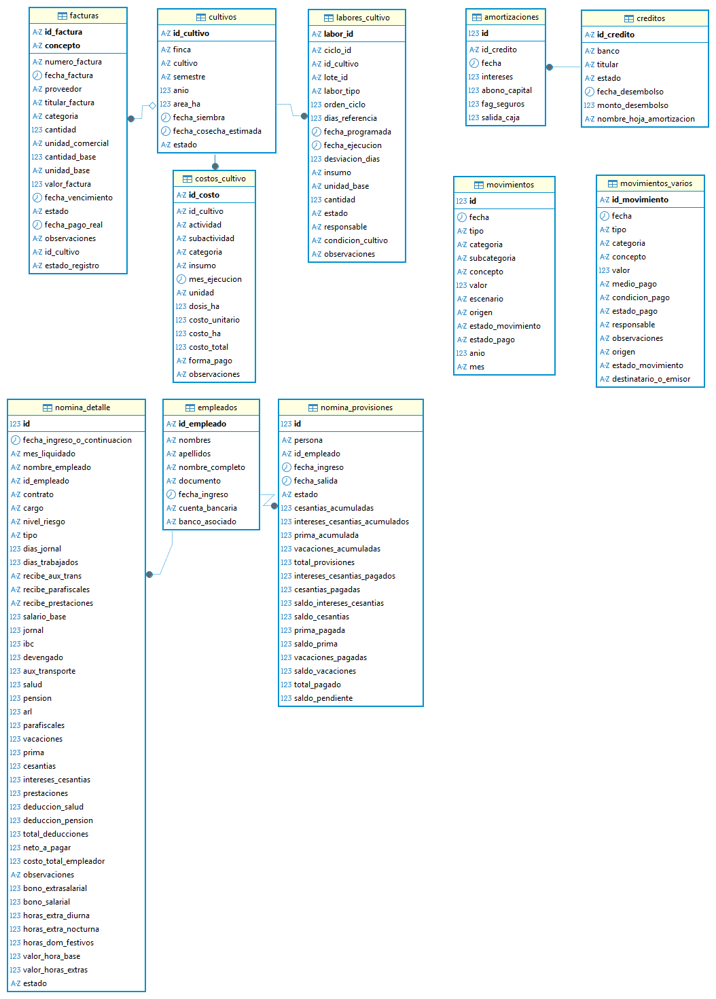
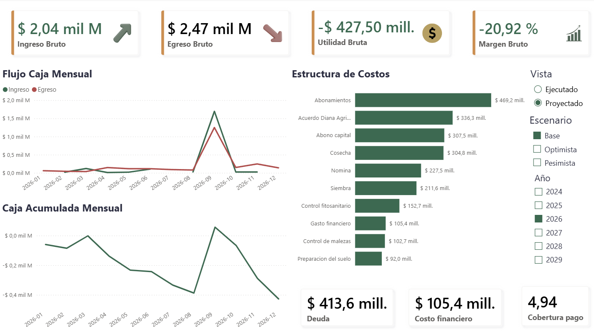
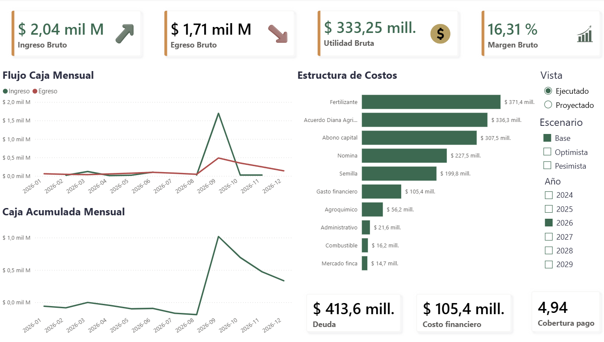
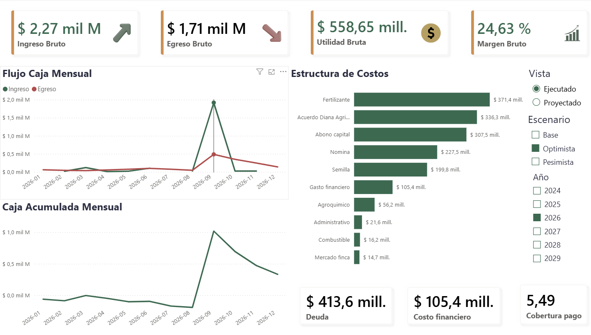

# Sistema end-to-end de doble eje para una operación agrícola familiar

Operación que siembra y cosecha arroz en la altillanura colombiana.

El sistema modela dos ejes: **vista** (Proyectado vs. Ejecutado) y **escenario de ingresos** (Pesimista, Base, Optimista). Diseñado para ser escalable y familiar para los usuarios:

**Google Sheets** (registro) → **PostgreSQL** (indicadores) → **Power BI** (resultados para decisiones informadas y anticipadas).

La idea: decidir con datos frescos y escenarios contemplados, para **anticipar en lugar de reaccionar**.

---

## El problema

El negocio lleva más de 10 años operando con decisiones administrativas sin respaldo en datos: créditos sin planeación, gasto sin criterio ni clasificación, y pagos de deuda sin priorización. Como agravante, los últimos 3 años sumaron caja improductiva, problemas de liderazgo y rotación de talento. El resultado fue un deterioro financiero que obligó a revisar todo para decidir con criterio.

La causa raíz no era técnica —en la parte agronómica el negocio es sólido— sino de **gestión y toma de decisiones**. El conocimiento del negocio existe, pero sin datos que lo respalden, cada decisión es puramente intuitiva. Este proyecto nace para cambiar eso: documentar y clasificar lo que realmente importa, comprender costos y contextos, y convertir la intuición en una **mezcla de experiencia + evidencia**.

---

## Arquitectura

```
┌─────────────────────────────────────────────────────────────┐
│  1. CAPTURA          Google Sheets                           │
│     Registro diario por usuarios no técnicos (familia).      │
│     5 documentos: 4 financieros/nómina conectados por        │
│     IMPORTRANGE + 1 agronómico (bitácora de labores).        │
└──────────────────────────┬──────────────────────────────────┘
                           │  export CSV
┌──────────────────────────▼──────────────────────────────────┐
│  2. TRANSFORMACIÓN   Python (ETL)                            │
│     etl.py: carga 10 CSV, respeta llaves foráneas,           │
│     normaliza columnas, valida integridad.                   │
└──────────────────────────┬──────────────────────────────────┘
                           │
┌──────────────────────────▼──────────────────────────────────┐
│  3. ALMACÉN Y KPIs   PostgreSQL                              │
│     Tablas normalizadas (financieras + agronómica). Queries  │
│     de liquidez, deuda, rentabilidad y estructura de costos. │
└──────────────────────────┬──────────────────────────────────┘
                           │
┌──────────────────────────▼──────────────────────────────────┐
│  4. VISUALIZACIÓN    Power BI                                │
│     Dashboard dinámico con doble eje (vista × escenario)     │
│     y modelo estrella con dimensión de calendario.           │
└─────────────────────────────────────────────────────────────┘
```


**¿Por qué esta arquitectura?** La captura vive en Google Sheets porque los usuarios son la familia, sin perfil técnico: registrar debe ser simple. PostgreSQL aporta integridad y potencia analítica que una hoja no da. El ETL en Python conecta ambos mundos de forma reproducible. Power BI traduce todo a decisiones visuales. Cada capa hace lo que mejor sabe hacer.

### El doble eje (núcleo del sistema)

Todo el modelo se organiza en dos ejes independientes que se combinan:

**Eje 1 — Vista** (`estado_movimiento`): distingue los costos **Proyectados** (estimados con base en agricultores de la zona) de los **Ejecutados** (los reales, que se costean y registran a través del tiempo). Permite comparar presupuesto vs. realidad y medir desviaciones.

**Eje 2 — Escenario** (`escenario`): modela tres futuros de ingreso según el precio de venta del arroz —**Pesimista, Base, Optimista**— sobre una misma producción esperada (promedio del consolidado familiar). No es una predicción, sino un rango de futuros posibles. Los precios se proyectan a partir de la percepción de los agricultores (voz a voz) y de las áreas de siembra proyectadas, que afectan los picos de cosecha. El escenario **Base** es el que rige actualmente.

**La regla de oro:** existe un tercer estado, `Fijo`, para lo que no cambia entre vistas ni escenarios: todo lo relacionado con deuda y nómina. Lo `Fijo` **siempre** se incluye, y Proyectado y Ejecutado **nunca** se suman entre sí —evitando el doble conteo y manteniendo la coherencia de los indicadores.

En el dashboard, ambos ejes son selectores dinámicos. Se puede ver, por ejemplo, *"la utilidad en escenario Pesimista con los costos ejecutados hasta hoy"* o *"la utilidad en escenario Optimista con los costos proyectados"*.

El propósito: anticipar decisiones con base en distintas proyecciones. La planeación anticipada da más margen de maniobra ante escenarios no contemplados que el no planear en absoluto.

---

## Stack técnico

| Capa | Herramienta | Uso |
|------|-------------|-----|
| Captura | **Google Sheets** | 5 documentos de registro por usuarios no técnicos (4 financieros conectados + 1 agronómico); fórmulas QUERY, IMPORTRANGE, ARRAYFORMULA, BUSCARV |
| ETL | **Python** | `pandas`, `SQLAlchemy`, `psycopg2`, `python-dotenv` — carga y transformación reproducible |
| Base de datos | **PostgreSQL** | 10 tablas normalizadas con integridad referencial; queries analíticas (CTEs, window functions, CASE) |
| Visualización | **Power BI** | Modelo estrella, medidas DAX, dimensión de calendario, selectores dinámicos |
| Versionado | **Git / GitHub** | Control de versiones y publicación del proyecto |
| Anonimización | **Faker** | Generación de datos demo para proteger información sensible (Ley 1581/2012) |

---

## Hallazgos clave

**1. El problema es de liquidez (caja), no de solvencia.**
El ratio de cobertura de deuda es **5.36x**: los ingresos anuales del arroz cubren el servicio de deuda más de cinco veces. Sin embargo, con costos proyectados y el precio de venta actual, la caja proyectada cierra diciembre en negativo. Al analizarla contra lo **ejecutado hasta hoy**, el cierre podría no ser negativo: aunque faltan costos por facturar, el inventario futuro estimado junto al director de cultivos indica que los costos restantes no bastarían para volver la caja negativa en diciembre.

A esto se suma que el precio base podría tender al alza —se espera competencia entre molinos por una cosecha regional menor a la de años anteriores—, lo que hace que un escenario optimista no sea descabellado. Aun así, la conclusión central de liquidez es **controlar los costos de cultivo**, históricamente altos, cuyo impacto en el rendimiento no varía mucho dado que el mercado ofrece nuevas moléculas de agroinsumos a mejor precio.

**2. La liquidez es estacional y crítica antes de la cosecha.**
La caja se vuelve negativa durante el ciclo y se recupera en el mes de venta de la cosecha. Esto define directamente las ventanas operativas donde se necesita financiación puente.

**3. El cuello de botella real son los costos, no la deuda bancaria.**
Con la deuda holgadamente cubierta, la palanca de rentabilidad está en los costos de cultivo (los fertilizantes son la categoría #1). Además, un acuerdo de deuda heredada (~20% de los costos) es un **lastre temporal con fecha de fin conocida**: al saldarse, libera caja de forma permanente. Distinguir ese lastre temporal de los costos estructurales —gestionables activamente— orienta la estrategia. En esa línea, el complejo familiar ya evalúa retornar a fertilizantes simples: más económicos que los compuestos y, según su experiencia, más eficientes.

---

## Dashboard

El dashboard combina los dos ejes en selectores dinámicos. Las mismas métricas cambian según la vista y el escenario elegidos:

**Proyectado — escenario Base** (el plan completo, con todos los costos presupuestados):



**Ejecutado — escenario Base** (lo realmente gastado hasta hoy):



**Ejecutado — escenario Optimista** (con precio de venta al alza):



---

## Plan de acción por escenarios
El sistema no solo describe el presente: prepara respuestas para cada futuro posible. Para cada escenario de precio, se define un **gatillo** (la señal que indica que ese escenario se está materializando), una **respuesta** (la acción planeada) y una **contingencia** (el plan si la situación empeora).

### Escenario Pesimista (precio de venta bajo)
- **Gatillo:** tras el pico de cosecha (agosto), la mayor oferta del gremio presiona el precio del arroz a la baja respecto al base.
- **Respuesta:** vender sin contratiempos — asegurar la entrada de caja aunque el precio no sea el ideal, porque la liquidez manda.
- **Contingencia:** renegociar pagos con proveedores: acuerdos con maquinaria propia como parte de pago, o diferir a plazos (hasta 3 años) para no comprometer la caja del ciclo.

### Escenario Base (precio actual)
- **Gatillo:** el mercado se mantiene en los niveles proyectados actuales.
- **Respuesta:** vender sin contratiempos, ejecutando el plan de costos previsto.
- **Contingencia:** llegar a acuerdos con el proveedor principal: aunque la prioridad es el ciclo actual, existen obligaciones bancarias que se extienden hasta 2027 y deben contemplarse.

### Escenario Optimista (precio al alza)
- **Gatillo:** la competencia entre molinos, por una menor cosecha regional, empuja el precio al alza.
- **Respuesta:** buscar los mejores compradores y aprovechar el margen extra para acelerar el pago de las deudas con mayor costo financiero, liberando caja anticipadamente.
- **Contingencia:** vender al mejor precio sin perder la confianza de los proveedores; reducir el costo financiero de la deuda y reproyectar la nueva caja liberada.

**El principio detrás:** no se trata de predecir el precio, sino de tener definida la respuesta para cada rango posible. La planeación anticipada da más margen de maniobra que reaccionar sin haber contemplado el escenario.

---

## Estructura del repositorio

```
sistema-financiero-lareforma/
│
├── sql/                    # Queries analíticas y esquema
│   ├── 00_tablero_caja_ambos.sql
│   ├── 01_liquidez_[proyectada|ejecutado].sql
│   ├── 02_endeudamiento_unico.sql
│   ├── 03_rentabilidad_[proyectada|ejecutado].sql
│   ├── 04_estructura_costos_[proyectado|ejecutado].sql
│   ├── 99_auditoria.sql              # Auditoría de integridad (4 capas)
│   └── esquema_labores_cultivo.sql   # Estructura (CREATE TABLE) de la bitácora agronómica
│
├── datos_demo/             # CSV anonimizados (Faker) para reproducir el proyecto
│
├── etl.py                  # ETL: carga los CSV a PostgreSQL respetando llaves foráneas
├── anonimizar.py           # Genera los datos demo protegiendo información sensible
├── .gitignore              # Protege credenciales (.env) y datos reales
└── README.md
```

### Dos niveles de análisis: financiero y agronómico

El sistema opera en dos granularidades complementarias, conectadas por `id_cultivo`:

- **Nivel financiero (general):** la tabla `cultivos` agrupa cada ciclo completo (ej. `A-2026-Arroz`). Aquí cuelgan facturas y costos — responde *"¿cuánto costó el ciclo?"*.
- **Nivel agronómico (por lote):** la tabla `labores_cultivo` registra cada labor de cada lote con su insumo y cantidad (ej. qué se aplicó al lote `1LR` y cuándo). Responde *"¿qué se hizo en cada lote?"*.

Cruzar ambos niveles permite, al cierre del ciclo, analizar rentabilidad por lote: gasto vs. ingreso de cada terreno.

**Nota sobre los datos:** los datos reales del negocio nunca se publican. La carpeta `datos_demo/` contiene una versión anonimizada con [Faker](https://faker.readthedocs.io/) que preserva la estructura y las relaciones, permitiendo reproducir el proyecto sin exponer información privada.
